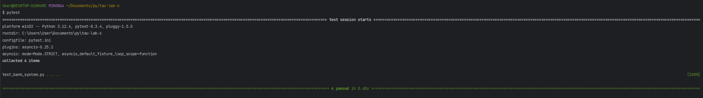

# Laboratorium 6 – pyTest

Kacper Sewruk **s23466**

Projekt przedstawia prosty system bankowy do obsługi transakcji (wpłaty, wypłaty, przelewy) realizowanych asynchronicznie w języku Python. Zawiera również zestaw testów jednostkowych i asynchronicznych napisanych z wykorzystaniem **pytest** i **pytest-asyncio**.

## Zawartość

- **bank_system.py**  
  Zawiera klasy:
  - `Account` – reprezentuje konto bankowe (z metodami: `deposit`, `withdraw` i asynchronicznym `transfer`).
  - `Bank` – zarządza kontami (m.in. tworzenie kont, pobieranie, asynchroniczne `process_transaction`).
  - `InsufficientFundsError` – wyjątek zgłaszany przy niewystarczających środkach.

- **test_bank_system.py**  
  Zawiera testy (w tym asynchroniczne) sprawdzające funkcjonalność klas `Account` i `Bank`:
  - Test poprawności wpłaty i wypłaty (w tym wyjątków `InsufficientFundsError` i `ValueError`).
  - Test asynchronicznego transferu środków.
  - Test tworzenia i pobierania kont z klasy `Bank`.
  - Test asynchronicznego przetwarzania transakcji (`process_transaction`).
  - Przykład mockowania (np. `asyncio.sleep`) z wykorzystaniem **unittest.mock**.

- **pytest.ini** (opcjonalnie)  
  Plik konfiguracyjny dla pytest

- **requirements.txt** (opcjonalnie)  
  Lista bibliotek potrzebnych do uruchomienia testów (m.in. `pytest`, `pytest-asyncio`).


## Uruchomienie testów oraz wyniki

Aby uruchomić testy, należy zainstalować wymagane biblioteki (jeśli nie są zainstalowane) i uruchomić **pytest**:
   ```bash
   pytest   
```

Przykładowy wynik testów:


## Testy

### Testy klasy `Account`

1. **Wpłaty (`deposit`)**  
   - Sprawdzenie poprawnego dodania środków.  
   - Sprawdzenie zachowania przy próbie wpłaty ujemnej kwoty (rzucenie `ValueError`).

2. **Wypłaty (`withdraw`)**  
   - Sprawdzenie pomyślnej wypłaty (saldo jest pomniejszane o odpowiednią kwotę).  
   - Obsługa niedostatecznego salda (rzucenie `InsufficientFundsError`).  
   - Obsługa wypłaty ujemnej kwoty (rzucenie `ValueError`).

3. **Transfer (`transfer`)**  
   - Test asynchronicznego transferu między dwoma kontami; sprawdzanie, czy saldo w obu kontach jest aktualizowane prawidłowo.  
   - Obsługa niedostatecznego salda (rzucenie `InsufficientFundsError`).  
   - Symulacja opóźnienia (`asyncio.sleep`), czyli zewnętrznej autoryzacji.

### Testy klasy `Bank`

1. **Tworzenie kont (`create_account`)**  
   - Poprawne utworzenie nowego konta.  
   - Próba utworzenia konta o numerze już istniejącym (rzucenie `ValueError`).

2. **Pobieranie kont (`get_account`)**  
   - Pobieranie istniejącego konta na podstawie numeru.  
   - Rzucanie `ValueError`, jeśli konto nie istnieje.

3. **Przetwarzanie transakcji (`process_transaction`)**  
   - Asynchroniczne wywołanie funkcji transakcyjnej (np. transferu) i sprawdzanie, czy saldo kont jest poprawnie aktualizowane.  
   - Symulacja opóźnienia (np. weryfikacja w zewnętrznym systemie).

### Testowanie wyjątków

- **`InsufficientFundsError`** — testowany w sytuacjach, gdy saldo jest niewystarczające przy wypłacie lub transferze.  
- **`ValueError`** — testowany przy próbie pobrania nieistniejącego konta, tworzeniu konta z już istniejącym numerem lub przy nieprawidłowych kwotach wpłaty i wypłaty (ujemna wartość).

### Mockowanie

- **Mockowanie zewnętrznych operacji** (np. komunikacji z zewnętrznym systemem) zademonstrowane na przykładzie **mockowania `asyncio.sleep`** z użyciem `unittest.mock.patch`.  
- Ten mechanizm można łatwo rozszerzyć, aby symulować dowolną zewnętrzną usługę, np. system autoryzacji transakcji.

### Testowanie asynchroniczne

- Wykorzystano **pytest-asyncio** (dekorator `@pytest.mark.asyncio`), aby uruchamiać metody asynchroniczne (`transfer`, `process_transaction`) w testach.


